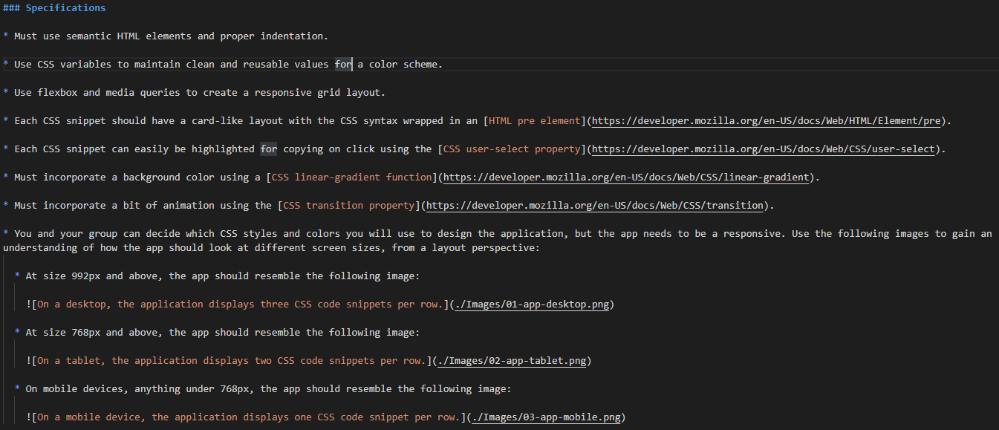

# mini-project-2

## **Description**

The purpose of this mini project was to combine various css properties with semantic HTML elements in order to build a webpage that showcases what students have learned thus far. The main goal of this project was to make use of the flexbox and media queries to create a responsive grid layout based on different screen sizes.

Over the course of this project, we also learned two new CSS properties (both of which were encorporated into the code). Those properties were linear-gradient and transition. 

## **Languages**
 
The languages used in this mini project are HTML and CSS.

## **Specifications**



## **Important Code Snippets**

We had initially indented our text within our `pre` tag. By making sure the code is flushed underneath the `pre` tag, the format of the code snippet appears correct.

```html
        <pre>
.row {
    display: flex;
    flex-direction: row;
    flex-wrap: wrap;
}       
                            
        </pre>
```

Our goal is to make sure that the grid layout changes based on the user's device. In order to do that, we added four css properties to our `section` selector to create a flexbox layout that holds the six `div` elements, each containing their own code snippet.

The `section` selector has a display property with a value of flex, thereby creating a block-level flex container. The flex-direction has been set to row and the flex-wrap has been set to wrap so that when the child containers (the `div`'s) fill the parent flex container (the `section` element), the `div` child containers will wrap underneath eachother. 

```css
section {
    display: flex;
    flex-direction: row;
    flex-wrap: wrap;
    justify-content: center;
}
```

We used a mobile-first approach. The `div` selector below occupies 100% of its parent flex container, moving the six `div` blocks into six rows, due to the flex-direction and flex-wrap properties defined in our `section` selector above.

```css
div {
    flex: 0 0 100%;
}
```

The below media query changes the `div` selector to occupy 50% of its parent flex container (the `section` element), when the screen is between 992px and 768px. This moves the six `div` blocks into a 2-column x 3-row grid configuration.

```css
@media screen and (min-width: 768px) {
    div {
        flex: 0 0 50%;
        max-width: 50%;
       }
}
```

The below media query changes the `div` selector to occupy 1/3 of its parent flex container (the `section` element), when the screen is above 992px. This moves the six `div` blocks into a 3-column x 2-row grid configuration.

```css
@media screen and (min-width: 992px) {
    div {
        flex: 0 0 33.333%;
        max-width: 33.33%;
    }
}
```